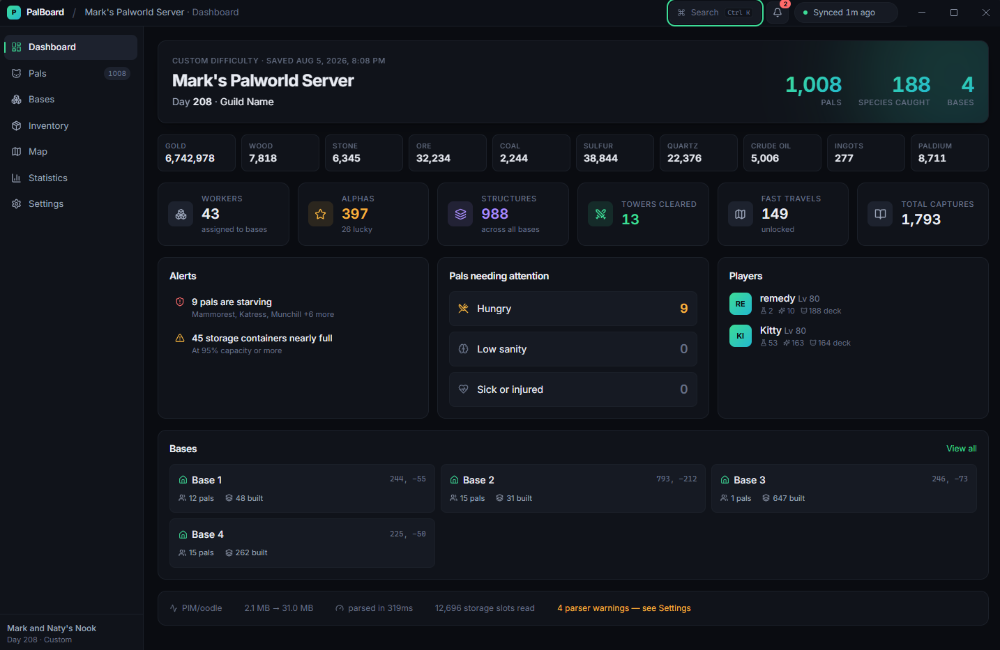
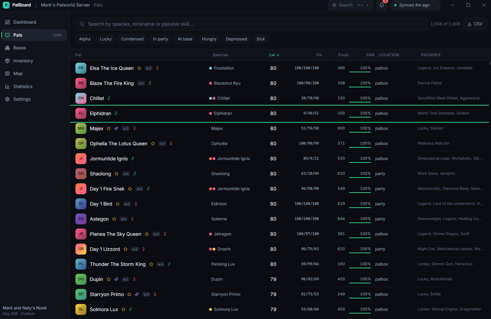
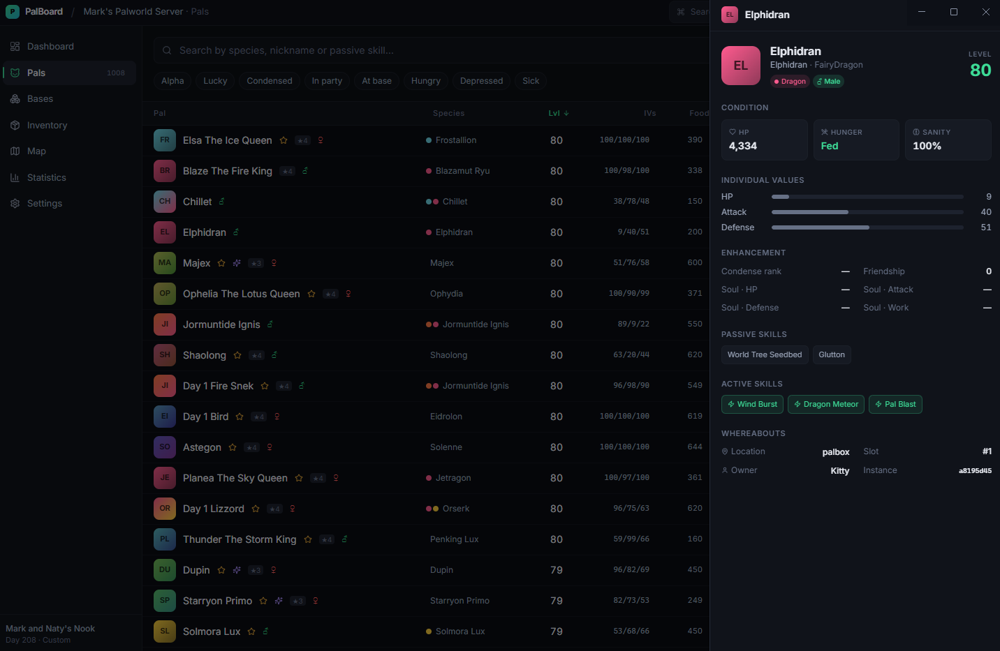
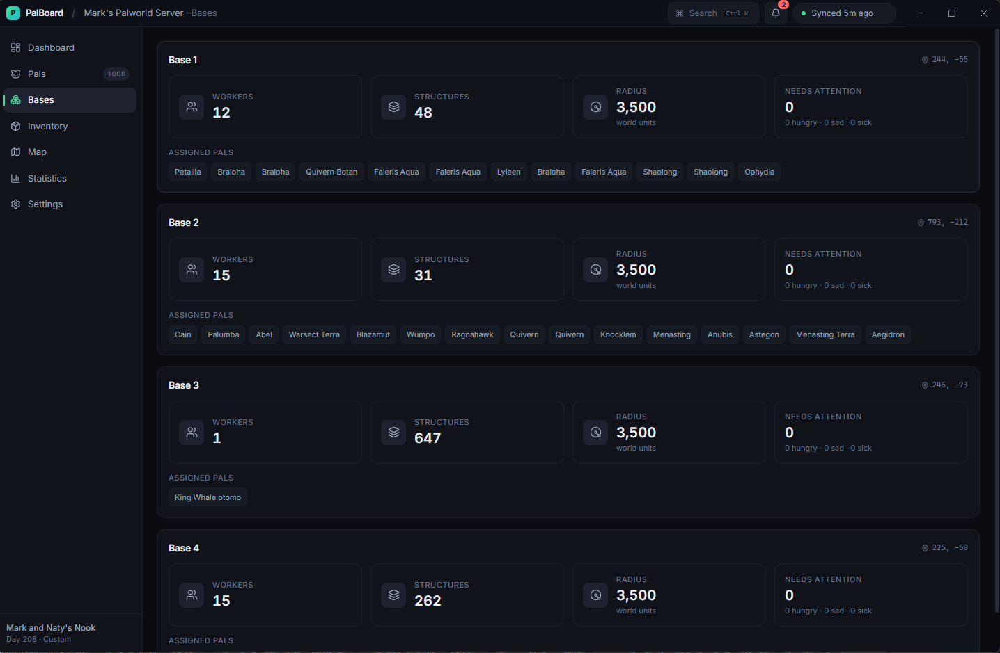
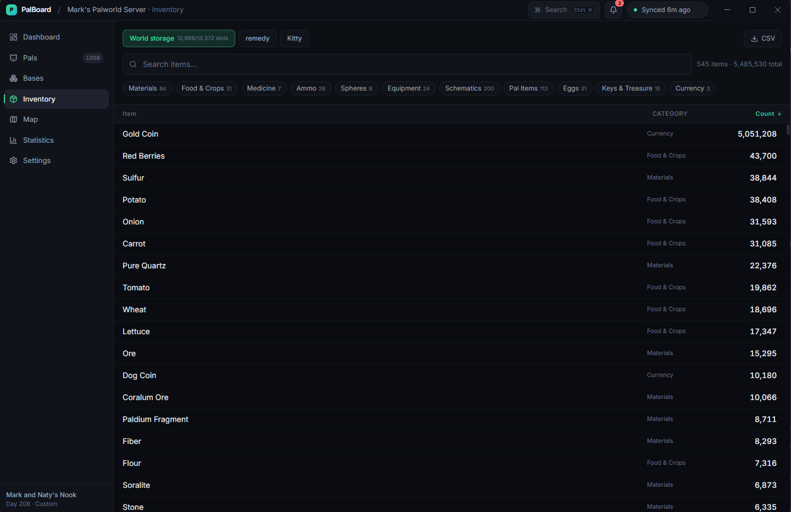
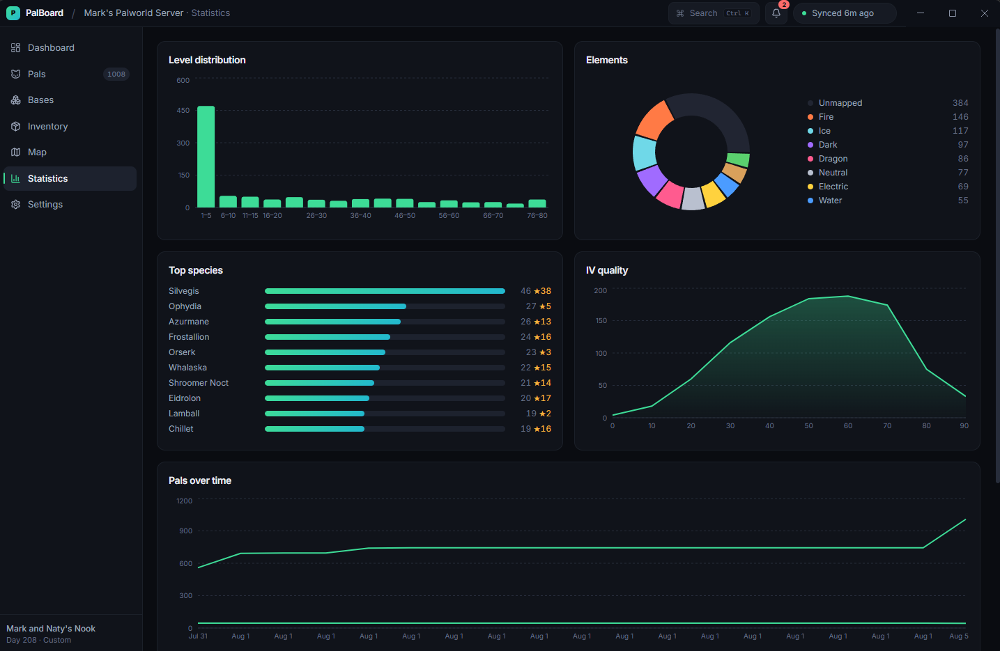

# PalBoard

**A real-time, read-only desktop dashboard for Palworld.** It finds your save, decodes a
proprietary binary format the game never documented, and keeps a live view of your world
on screen while you play.

<p>
  
  
  
  
  
  
</p>



The save file is a 31 MB Unreal Engine `GVAS` tree wrapped in an undocumented container and
compressed with Oodle, a proprietary codec. PalBoard opens it in **~320 ms**, end to end —
1,008 pals, 4 bases, 988 structures and 12,696 storage slots — then re-reads it within a
couple of seconds of every autosave. It never writes to your saves.

## Engineering highlights

- **Reverse-engineered binary format.** Three container variants (`PlZ`, `PlM`, `CNK`), a
  generic UE 5.1 `GVAS` property reader, and Palworld-specific `RawData` decoders — written
  from scratch against real saves.
- **~320 ms cold parse of a 31 MB tree** via selective subtree skipping and a read-only
  decode path that drops UE's round-tripping metadata.
- **Built to survive game patches.** Every container property parses inside a boundary that
  restores the cursor on under-read, over-read, or throw, so a format change costs one
  subtree instead of the whole save — and surfaces as a visible warning, not silent drift.
- **Authoritative game data**, extracted from Palworld's own localisation tables rather than
  guessed: 322 pals, 1,993 items, 1,141 skills.
- **Strict process isolation.** Context-isolated preload, a typed IPC contract shared by both
  processes, and no write path anywhere in the codebase.
- **111 tests** across the parser, compression, watcher, and domain logic.

---

## Screens

### Dashboard

The landing view ([`main_screen.png`](assets/main_screen.png), above) resolves the whole world
into one screen: a live resource strip, workers, alphas, structures, towers and fast travels;
alerts for starving pals and near-full storage; a per-player breakdown with Paldeck progress;
and base cards with their in-game compass coordinates. The status bar along the bottom reports
the parse itself — container codec, compression ratio, timing, slots read, and any warnings.

### Pals

| Virtualized table | Detail drawer |
|---|---|
| [](assets/pal_screen.png) | [](assets/pal_screen_2.png) |

All 1,008 owned pals in a virtualized table that stays smooth at any world size — nicknames,
real species names and elements, level, IVs, food, sanity, whereabouts and passive skills, with
full-text search, quick filters (alpha, lucky, condensed, hungry, depressed…), sorting, and CSV
export.

Selecting a row opens a detail drawer: live condition, individual values as bars, condense rank
and soul enhancements, passive and active skills, and exactly where the pal lives — container,
slot index, owner, and instance id.

### Bases and inventory

| Bases | Inventory |
|---|---|
| [](assets/bases_screen.png) | [](assets/inventory_screen.png) |

**Bases** lists each camp with its worker count, structure count, real influence radius in world
units, an attention counter for hungry, sad or sick workers, and the full assigned roster.

**Inventory** decodes and aggregates every storage container in the world — 12,696 of 13,372
slots here, 545 distinct items, 5.4 M units — split by world storage and each player's pouch,
then searched, category-filtered, sorted and exported to CSV.

### Statistics

[](assets/statistics_screen.png)

Level distribution, element mix, top species with alpha counts, and IV quality across the
collection. **Pals over time** is recorded by PalBoard itself — the save keeps no history, so
the app maintains its own time series across sessions.

Not pictured: an interactive **Map** in the game's own compass coordinates showing bases with
their influence radius and last player positions, a `Ctrl+K` command palette that fuzzy-searches
pals, items, bases and actions, and a settings page exposing world switching, themes and parser
diagnostics.

---

## How it works

### The save format

Palworld saves are GVAS (Unreal Engine 5.1 `SaveGame`) payloads inside a small custom container.
Three variants exist in the wild; PalBoard reads all three.

| Magic | Codec | Seen in |
|-------|-------|---------|
| `PlZ` | zlib, single or double pass | Palworld < 0.6 |
| `PlM` | Oodle (Kraken/Mermaid family) | Palworld ≥ 0.6, including 1.0 |
| `CNK` | Xbox/Game Pass envelope around one of the above | Game Pass |

Oodle is proprietary, so decoding uses [`ooz-wasm`](https://github.com/SnosMe/ooz-wasm) — a
WebAssembly build of the open-source `ooz` reimplementation. It is decode-only, which is all a
read-only dashboard needs.

### Two things make it fast

**Selective parsing.** `Level.sav` decompresses to ~31 MB, but a large share of that is world
foliage and dungeon spawner state a dashboard never shows. Every GVAS property declares its own
byte length, so the parser seeks straight past those subtrees (`LEVEL_SKIP_PATHS`) instead of
allocating millions of objects.

**Read-only decoding.** Because PalBoard never writes saves, the parser discards UE's
round-tripping metadata — property GUIDs, struct ids, declared type names — and decodes directly
to plain JS values. An `IntProperty` becomes a `number`, not a wrapper object.

### Resilience to game updates

Palworld reshapes its save between patches. The parser is built so that costs one subtree, not
the whole save:

- Container properties parse inside a boundary that restores the cursor to the property's
  declared end — whether the inner parse under-read, over-read, or threw.
- Unknown property types are skipped by declared size rather than desynchronising the stream.
- Unrecognised struct types fall back to a nested property walk.
- Every recovery is reported as a warning and surfaced in the UI, so drift is **visible** rather
  than silent.

### Names and static data

The save stores developer ids (`AmaterasuWolf_Dark`, `Pal_crystal_S`) and no static per-species
data. Rather than ship a hand-maintained community table, PalBoard extracts display names
straight from the game's own localisation assets (`tools/extract-gamedata.ts`) — 322 pals, 1,993
items, 1,141 skills. Anything unmapped renders as a humanised id rather than a guess.

## Architecture

```
electron/            main process — never exposed to the renderer
  parser/
    compression.ts   PlZ / PlM / CNK container handling
    gvas/            generic Unreal GVAS reader + property parser
    palworld/        type hints, RawData decoders, domain mapping, alerts
    loader.ts        world folder -> SaveSnapshot
  locator/           save auto-discovery and folder validation
  watcher/           debounced, write-aware file watching
  services/          SaveStore (source of truth), history, prefs, export
  api/               IPC handlers
shared/              domain model, typed IPC contract, extracted game data
src/                 renderer (React) — pages, components, stores
tests/               parser, compression, watcher and business-logic tests
tools/               dev utilities: survey, probes, verify, data extraction
```

**Separation of concerns.** The GVAS parser knows nothing about Palworld — it leaves
game-specific `RawData` blobs as `Buffer`s. `parser/palworld/` decodes those and maps them onto
`shared/domain`. The renderer only ever sees domain types, so a save-format change is absorbed
in a single layer.

**Single source of truth.** The main process owns state. The renderer mirrors it and issues
commands; it never derives save data independently.

**Live sync.** A debounced, write-aware watcher coalesces the burst of writes one autosave
produces into a single reparse, ignores the game's own backup folder, and pushes a new snapshot
to the renderer.

## Tech stack

**Main process** — Electron 37, `chokidar`, `ooz-wasm`, Node `zlib`
**Renderer** — React 19, TypeScript 5.8, Tailwind v4, Zustand, TanStack Table/Virtual/Query,
Recharts, React Router
**Build & test** — Vite 7, electron-vite, Vitest, Playwright, electron-builder (NSIS)

## Getting started

```bash
npm install
npm run dev        # hot-reloading dev app
npm run build      # typecheck + production build
npm start          # run the built app
npm test           # 111 tests across parser and business logic
npm run dist       # packaged Windows installer
```

PalBoard auto-detects Palworld worlds in both Windows and Proton/Wine layouts, remembers the
last one, and otherwise lets you point it at a folder.

### Development tools

```bash
npx vite-node tools/verify.ts             # load a save, print the domain model
npx vite-node tools/survey.ts <worldDir>  # size every subtree of Level.sav
npx vite-node tools/probe-fields.ts <dir> # union every field across all characters
node tools/drive.mjs                      # launch the built app and screenshot it
```

## Safety

PalBoard opens save files for reading only. There is no write path in the codebase — the Oodle
binding is decode-only and the preload bridge exposes no mutation API. It is safe to leave
running while you play.

## Licence

GPL-3.0-or-later, inherited from `ooz-wasm`.

See [ROADMAP.md](ROADMAP.md) for what's planned and [TASKS.md](TASKS.md) for current work.
